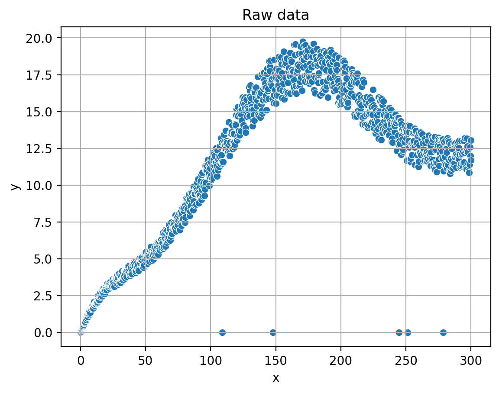
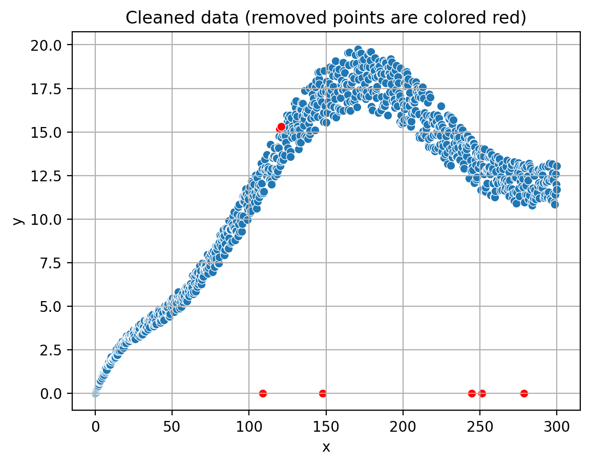
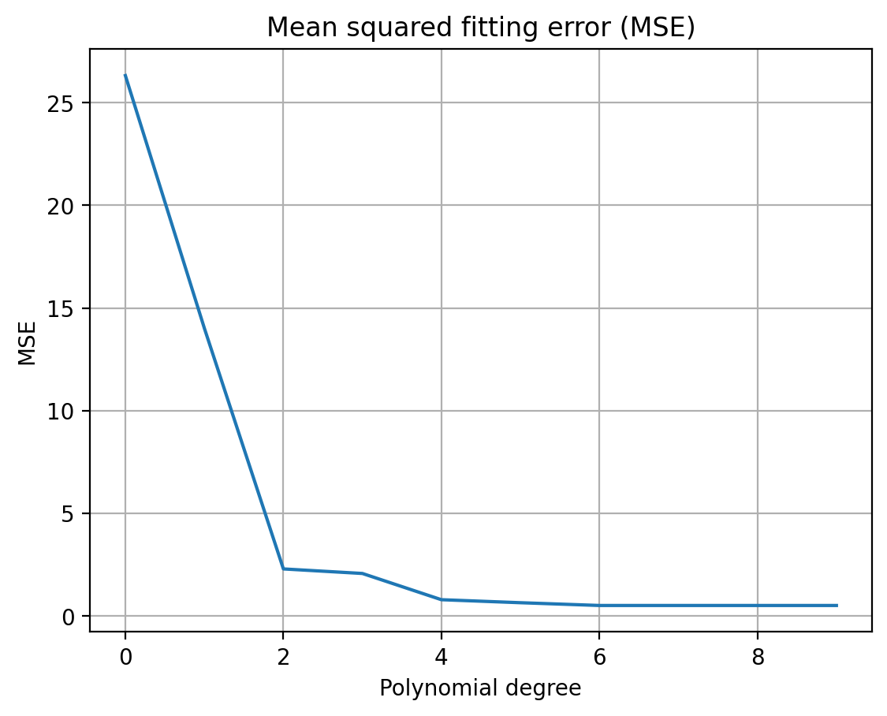

# Create and clean data, fit polynomials
2023-05-20, J. Köppern

Here you'll find a Python app (deployed on [Azure](https://polynomial-regression-demo.azurewebsites.net/)) with a Streamlit UI for approximating (modelling) data with a polynomial. This showcasing app
- generates synthetic data with noise and outliers,
- removes these outliers using a variant of the interquartile range method and
- fits polynomials of various degrees into the data to determine a suitable degree for the approximation.

Hint: Terms, such as suitable or goodness of approximation, must be defined quantitatively in order to be used further. This will be done in the following.

## Insertion - what's a polynomial

A polynomial is a mathematical expression consisting of variables and coefficients, combined using addition, subtraction, and multiplication operations. It can be represented as a sum of terms, where each term is a product of a constant coefficient and a variable raised to a non-negative integer power. For example, a quadratic polynomial can be written as $$f(x) = ax^2 + bx + c$$, where *a*, *b*, and *c* are coefficients and *x* is the variable.

## Generating synthetic data

The synthetic data is generated using Python by creating a base polynomial function and adding noise and outliers to it. This process involves
- defining interpolation points,
- fitting a polynomial through these points, and
- introducing noise and outliers to the resulting curve.

The generated data is then stored in a pandas DataFrame for further processing and analysis. In the provided source code, this process is triggered when the user clicks the "Create" button, which calls the `create_data` function. The complete implementation details can be found in the source code, allowing readers to explore and understand the data generation process as sketch in the following.

To create the synthetic data using Python, I follow these steps:

1. Define a set of interpolation points (x, y) through which the base polynomial should pass.

2. Fit a polynomial of the desired degree to these points using the numpy.polyfit function, which returns the polynomial coefficients.
3. Create a numpy.poly1d object using the obtained coefficients, which represents the base polynomial function.
4. Generate a set of x-values (`x_poly`) using numpy.linspace within the desired range.
5. Calculate the corresponding y-values (`y_poly`) by evaluating the base polynomial function at the `x_poly` points.
6. Add noise to the `y_poly` values by generating random values within a specified range (`noise_magnitude`) and adding them to the original `y_poly` values.
        7. Introduce outliers by randomly selecting a few indices in the `y_poly` array and setting their values to a specific outlier value (e.g., 0).
8. Combine the `x_poly` and `y_poly_with_noise_outliers` arrays into a dictionary and create a pandas DataFrame based on it.
9. Save the generated DataFrame as a CSV file for further use.

The `create_data` function in the source code implements these steps, and it is called when the user clicks the "Create" button in the app.

## Date clean-up: Outlier removal

The Interquartile Range (IQR) cleanup method is used to remove outliers from the synthetic data. The IQR method is a robust technique for identifying and eliminating data points that deviate significantly (see next paragraph) from the overall distribution. By applying this method, we can preprocess the data and improve the accuracy of the polynomial fitting process. The app provides an interactive way to adjust the parameters for outlier removal, allowing users to explore the impact of different settings on the cleaned data.

The idea behind the Interquartile Range (IQR) method is to measure the statistical spread of the data and identify data points that lie outside a certain range. The IQR is calculated as the difference between the 75th percentile (Q3) and the 25th percentile (Q1) of the data. Data points that fall below Q1 - k * IQR or above Q3 + k * IQR, where k is a user-defined multiplier, are considered outliers.

This method is robust against the influence of extreme values, as it focuses on the central portion of the data distribution. By removing the identified outliers, we can obtain a cleaner dataset that better represents the underlying structure, which in turn improves the accuracy of the polynomial fitting process.

In the provided source code, the IQR cleanup method is implemented within the `outlier_detection_iqr` and `process_data_in_windows` functions. Here's how it's done:

The `outlier_detection_iqr` function takes a DataFrame (df), a column name (column), and a multiplier (k) as input arguments.

1. It calculates the 25th percentile (Q1) and the 75th percentile (Q3) of the specified column in the DataFrame.
2. The Interquartile Range (IQR) is computed as the difference between Q3 and Q1.
3. Lower and upper bounds for outlier detection are calculated as Q1 - k * IQR and Q3 + k * IQR, respectively.
4. The function returns a filtered DataFrame containing only the data points that lie within the lower and upper bounds.

The `process_data_in_windows` function is responsible for applying the IQR cleanup method to the data in a sliding window fashion:

1. It takes a DataFrame (df), a column name (column), a window size, and a multiplier (k) as input arguments.
2. The function divides the DataFrame into windows of the specified size.
3. For each window, it calls the `outlier_detection_iqr` function to remove outliers.
4. The cleaned windows are concatenated to form a new DataFrame containing the cleaned data.

In the app, the IQR cleanup process is triggered when the user clicks the "Remove outliers" button. Users can adjust the window size and multiplier using sliders provided in the app's interface.

## Fitting polynomials

Finding the Best-suited Degree (*best* is to be defined) In this section, we will discuss the process of fitting polynomials to the cleaned data and evaluating their approximation errors to determine the best-suited polynomial degree. The app fits polynomials of various degrees to the data and calculates the mean squared error for each degree. By comparing the errors, we can identify the optimal polynomial degree that provides the best balance between complexity and accuracy. The app also visualizes the fitted polynomials, allowing users to observe the impact of different polynomial degrees on the data approximation.

The concept of polynomial fitting involves finding a polynomial function that best approximates the given data points. This is achieved by minimizing the difference between the actual data points and the corresponding points on the polynomial curve. In our app, we use the numpy.polyfit function to fit polynomials of different degrees to the cleaned data and calculate their coefficients.

The fitting process is implemented in the `fit_poly` function in the source code, which performs the following steps:
1. Iterate through a range of polynomial degrees.
2. For each degree, fit a polynomial to the cleaned data using the numpy.polyfit function.
3. Create a numpy.poly1d object using the obtained coefficients, representing the fitted polynomial function.
4. Evaluate the polynomial function at the x-values of the cleaned data to obtain the approximated y-values.
5. Calculate the mean squared error between the actual y-values and the approximated y-values.
6. Store the degree and the corresponding mean squared error in a pandas DataFrame.

In the app, the polynomial fitting process is initiated when the user clicks the "Fit polynomial" button. Users can also choose to display the plots of the fitted polynomials by checking the "Insert plots" checkbox.

The fitted polynomials and their respective approximation errors are visualized in form of a table by the app, allowing users to analyze the results and determine the optimal (for definition see below) polynomial degree for their data. The complete implementation details can be found in the source code, enabling readers to explore and understand the polynomial fitting process.

## Choosing the optimal degree

Choosing the Optimal Degree: Balancing Complexity and Accuracy In this section, we will discuss the importance of selecting the optimal polynomial degree for fitting the cleaned data. It is crucial to define "optimal" or "best" in a quantitative manner, as it helps in making an informed decision based on the trade-offs between complexity and accuracy. In the context of polynomial fitting, optimality can be related to the balance between overfitting and underfitting, the elbow curve of error over degree, and the point where the decrease of the fitting error diminishes over the degree.

Overfitting occurs when a polynomial of a high degree fits the data too closely, capturing the noise and outliers in the data. This results in a model that performs well on the training data but poorly on new, unseen data. On the other hand, underfitting occurs when a polynomial of a low degree is unable to capture the underlying structure of the data, leading to a poor approximation.

To choose the optimal degree, we can analyze the elbow curve, which is a plot of the fitting error (e.g., mean squared error) against the polynomial degree. As the degree increases, the fitting error generally decreases. However, there is a point where the decrease in fitting error becomes negligible or starts to increase due to overfitting. This point, often referred to as the "elbow point," can be considered as the optimal degree for the polynomial fitting.

In the app, the elbow curve is visualized, allowing users to observe the relationship between the fitting error and the polynomial degree. By analyzing this curve, users can identify the optimal degree that provides the best balance between complexity and accuracy, ensuring a robust and reliable polynomial fit for the cleaned data.